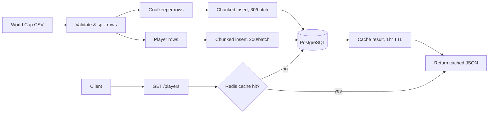

# World Cup Player Stats Pipeline
> A CSV-to-Postgres data pipeline with a Redis-cached API for exploring World Cup player and goalkeeper stats.

[Live demo](https://world-cup-data-pipeline.onrender.com) · [GitHub](https://github.com/Banhhmii/World-Cup-Data-Pipeline)

---

## The Problem

Raw World Cup player stats sit in a flat CSV file — nothing structured or queryable exposes them. Outfield players and goalkeepers also need different stat shapes (goals/assists vs. saves/clean sheets), which a single flat table can't represent well.

## The Solution

An ingestion pipeline reads and validates the CSV, splits rows into players vs. goalkeepers, and inserts them into normalized Postgres tables in fixed-size chunks (to stay under Postgres's parameter limit). A Redis-cached `GET /players` endpoint serves the data, and a small vanilla-JS frontend renders it into stat cards.

---

## Architecture



Two independent paths: a one-time/re-runnable **ingestion path** (CSV → validate → chunked insert, so no single query exceeds Postgres's 65,535 bound-parameter limit) and a **read path** (`GET /players`) that checks Redis before ever touching Postgres, so a cache outage degrades to a normal DB read instead of taking the endpoint down.

---

## Tech Stack

- **Frontend:** Vanilla HTML/CSS/JS (no framework)
- **Backend:** Node.js, Express 5
- **Database:** PostgreSQL (Supabase), Knex for migrations
- **Cache:** Redis (cache-aside, 1hr TTL on `/players`)
- **Deployment:** Render
- **Other:** Jest + Supertest (17 tests against an isolated Postgres `test` schema), `csv-parser` for ingestion, `express-rate-limit` (100 req/15min on `/players`)

## Key Features

- CSV ingestion pipeline that validates and transforms rows into player/goalkeeper shapes
- Chunked batch inserts — players (200/chunk) and goalkeepers (30/chunk) are inserted in fixed-size chunks so a single insert never exceeds Postgres's 65,535 parameter limit
- Fail-soft batch inserts — `Promise.allSettled` means one table's bad batch doesn't block the other, and a chunk failure within a table still reports how many rows committed before it
- Redis-cached `GET /players` endpoint with a 1-hour TTL
- Rate-limited API and structured request logging
- 17 automated tests, including a real Postgres-constraint failure test and per-chunk coverage, run against an isolated schema so tests never touch production data

---

## API Reference

### GET /players

Return all ingested player and goalkeeper stats.

**Auth required:** No  
**Rate limit:** 100 requests / 15 minutes  
**Cache:** Redis, 1-hour TTL — a cache hit returns straight from Redis and skips Postgres entirely

```
GET /players
```

**Response `200 OK`:**

```json
{
  "players": [
    {
      "id": 1,
      "name": "Kylian Mbappé",
      "age": 25,
      "country": "France",
      "position": "FW",
      "goals": 8,
      "goals_per_90": 1.14,
      "assists": 2,
      "yellow_cards": 1,
      "red_cards": 0,
      "points_per_game": 2.4
    }
  ],
  "goalkeepers": [
    {
      "id": 1,
      "name": "Emiliano Martínez",
      "age": 31,
      "country": "Argentina",
      "position": "GK",
      "saves": 18,
      "saves_pct": 75.0,
      "goals_conceded": 6,
      "goals_conceded_per_90": 0.86,
      "clean_sheets": 4
    }
  ]
}
```

**Error responses:**

| Status | Body |
|---|---|
| `429 Too Many Requests` | `Too many requests from this IP, please try again after 15 minutes` (plain text — this route doesn't wrap rate-limit errors in a JSON envelope) |
| `500 Internal Server Error` | `{ "error": "Internal Server Error" }` |

---

## Setup (Run Locally)

### Prerequisites
- Node.js v18+
- A PostgreSQL instance (e.g. Supabase)
- A Redis instance

### Installation

Clone the repo
```
git clone https://github.com/Banhhmii/World-Cup-Data-Pipeline.git
cd World-Cup-Data-Pipeline
```

Install dependencies
```
npm install
```

Set up environment variables
```
cp .env.example .env
# Then edit .env with your values
```

Run migrations
```
npm run migrate
```

Load the CSV data (one-time)
```
node dataPipeline.js
```

Start the server
```
npm start
```

Optional — run the test suite
```
npm test
```
Runs against an isolated `test` Postgres schema (auto-created and migrated by `jest.globalSetup.js`) — never touches your `public` data.

### Environment Variables

See `.env.example` for the full list. You'll need:
- `PG_CONNECTION_STRING` — Postgres connection string
- `REDIS_URL` — Redis connection string
- `PORT` — optional, defaults to 3000

---

## What I Learned

- Getting Redis to connect wasn't working at first — I dug into the docs instead of guessing, got the cache-aside pattern working, and later confirmed it end-to-end: I hit `GET /players` twice, saw the first call read from Postgres and the second return `Returning cached players` from the Redis cache.
- Writing `renderPlayers` and the fail-soft batch summary from scratch (rather than working from a diff) was a deliberate drill, and it was a struggle, but it's the kind of thing that sticks once you've actually typed it yourself instead of reading someone else's version.

## Credits

Built by Tommy Ngo as part of my self-taught journey into software engineering.

- https://www.linkedin.com/in/tommy-ngo1
